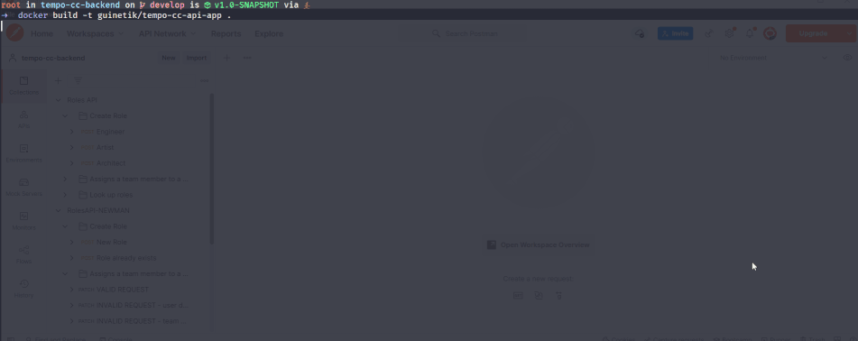

## RUNNING THE APP
`mvn install`

`docker build -t guinetik/tempo-cc-api-app .`

`docker run -p 8080:8080 guinetik/tempo-cc-api-app`

After booting docker, server should be available at localhost:8080.
I added a Postman collection with my sample requests and API testing scripts. You can import the collection and call the endpoints after the app boots up on docker.

If you don't want to use docker, after mvn install, go to the folder tempo-cc-api-app and run

`mvn spring-boot:run`

## API-FIRST APPROACH

As I was checking the specification, I immediately started to scribble an API on editor.swagger.com.

After modeling the api, I felt it was ready for the next step: creating a simple maven project to turn my swagger yml into generate java code. The swagger generator plugin for maven allows to generate classes based on yml api definiton. Since I knew I was going to use Spring, by doing this first I skip a bunch of configuration boilerplate on spring later.

I spend some time tweaking the pom.xml, but eventually I have a generated-sources folder with all my api definitions.

## DATA DIVE

Now that I'm more familiar with the data and business rules, I went to SQL developer to model a database for the project, which I eventually will turn into JPA entities.

## MAVEN

Coming back to Java, I created a new maven project that uses the spec project I created earlier a dependency as well as the generated classes. I also created a parent pom, so I can build both projects simultaneously, this will help later when I dockerize the app.

With both projects configured, one for the API and other for the business logic, I can make changes to the swagger yaml, run a mvn install and easily adapt the app to the new api definition.

## JPA

Now I'm focused on bringing the database model I sketched earlier into JPA entities. I spend some time mapping and creating the repositories. I created some test classes to help me do this more efficiently.
Since this is a microservice that doesn't hold all the data, I simply created tables with autonumeric IDs and a reference to the original system's id. 
This way, the relationship between user, teams and roles is preserved and can be used for future features. This also helps keep constraints in check and our indexes low.

As I was modeling the JPA entities and Repositories, I started thinking about all the validations that I would need to do to keep the data consistent across the two systems and for that I would also need a remote api client.

## REMOTE API CLIENT

There are many ways to consume a remote API in Java, but my favorite by far is Feign, a declarative library that lets you create interfaces that represent API calls. The result is a cleaner less verbose code, full decoding options and a lot of features.

I started by porting the endpoints in the specification to Feign interfaces using the @RequestLine annotation. I didn't want to use the spring-boot starter for Feign because in my opinion the autoconfiguration adds much more than I need for this project, so I opted to use the raw OpenFeign library.

With that in mind I created a little factory that would create the Feign classes based on the API Interfaces I wrote earlier, then using reflection I would make this factory generic for every Feign interface in the app, allowing for a single point of control over all my API requests.

## SERVICES LAYER

Let's review. We now have:
* A swagger api definition, hooked up with a maven plugin to generate Spring controllers and models based on that definition. 
* A JPA entity setup to a h2 in file memory db. This is our local domain. 
* A remote API factory to make calls to the original endpoints in order to get team and user data.

**All these ingredients will coalesce in our services layer.** 

First I create a service to manage the Roles.
I added skeleton NOT IMPLEMENTED methods to it and hooked it up with the controller delegate. This is an interface that the swagger generator allows me to implement. This will give me control over all endpoints and summarize them in a single elegant class.

By this point I have moved my swagger api from the swagger editor on the browser and started using Postman, so I can test a couple of endpoints just to see if my controller was reaching the delegate and the delegate was reaching the service correctly.

Now it was time to implement some business logic in the service.

Started small. Add a new role. Add duplication prevention for the name.

Now for the prime-time feature, Role Assignment. I started a new unit test. 

Right now I know that my remote api calls are not working because of feign, so I would like to mock them for now and focus on the role assignment.

I created a couple of tests to go through the happy route, checking if a user exists on the remote api, creating a user on our local domain, doing the same thing for the team then I would assign a role for this membership.

With that happy route setup, I returned to Feign related stuff and managed to get the API calls working! _YAY!_

Now I'm ready to do some fringe cases tests. I ended up creating some validations to not allow invalid teams, invalid users, if you try to add a role in a team a user is not a member of, it returns an exception too.

By this point I also realized that you cannot have a user assigned to more than one role inside the same team, so I implemented a validation for that too and created another validation to check if a user already has a role in the team.  Since this is a PATCH operation, the idea of overriding the values is implicit, so in this case, I would delete the previous role of this user in the team and adding the new one. This is how I interpreted the spec, but if it's wrong, we can comment 2 lines and let the users have more than 1 role in the same team.

I finished with the two look up options. Nothing fancy, but I ended up moving the object creation and transformations to it's own utils class so I could reuse it across the services.

Services are done. I perform more tests on Postman. My coverage is good. Now we can really use some...

## EXCEPTION HANDLING

I always added exceptions since the beginning, but I was using the default Exception package from java. From there I decided to make custom exceptions and hook them up in my controller delegate so when I would throw these, it would raise the appropriate http statuses.

## DOCKER

With the API ready and some testing done in Postman. I feel like most of the development is done.

I create a simple docker file to set up some permissions for directories used by the app. Using the alpine jdk image, I simply copy the target .jar file after the maven compilation and add it to docker as an entrypoint.

## POSTMAN AND NEWMAN

Coming full-circle, I finished the app by creating a NodeJS project and trying to do a whole pipeline testing, from the maven installation, to running a postman collection using the command line. I added this project in the postman folder, there`s a readme.md there as well.

# Thanks for checking out my work! :)

guinetik
2022-05-12
